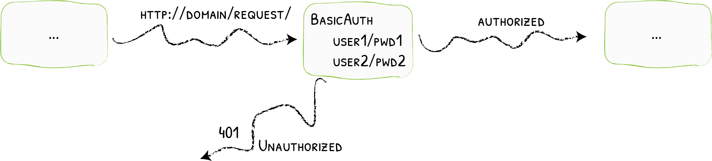
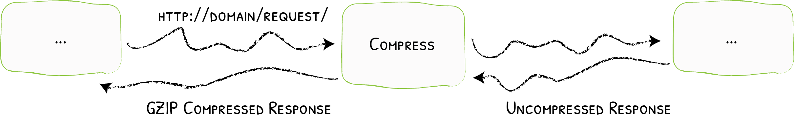
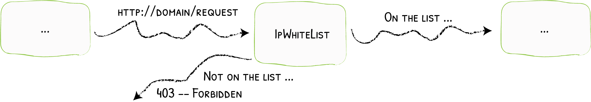
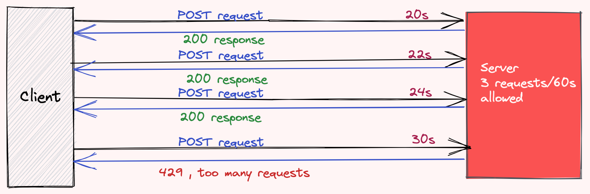
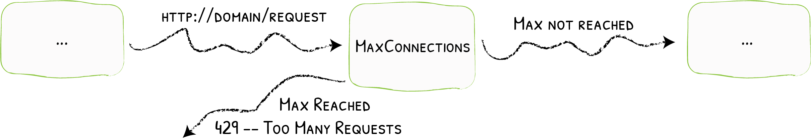
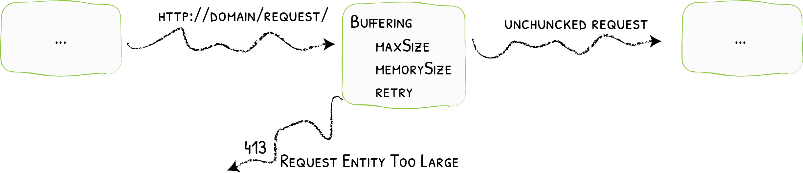

## خوش آمدید

دژ یک روتر Edge منبع باز است که انتشار خدمات شما را به تجربه ای سرگرم کننده و آسان تبدیل می کند. درخواست ها را از طرف سیستم شما دریافت می کند و متوجه می شود که کدام مؤلفه ها مسئول رسیدگی به آنها هستند.

آنچه دژ را متمایز می کند، علاوه بر ویژگی های بسیار، این است که به طور خودکار پیکربندی مناسب برای خدمات شما را کشف می کند. جادو زمانی اتفاق می افتد که دژ زیرساخت شما را بررسی می کند، جایی که اطلاعات مربوطه را پیدا می کند و کشف می کند که کدام سرویس به کدام درخواست پاسخ می دهد.

با دژ نیازی به نگهداری و همگام سازی یک فایل پیکربندی جداگانه نیست: همه چیز به طور خودکار، در زمان واقعی اتفاق می افتد (بدون راه اندازی مجدد، بدون قطع اتصال). با دژ زمان را صرف توسعه و استقرار ویژگی‌های جدید در سیستم خود می‌کنید، نه برای پیکربندی و حفظ حالت کار آن.

با توسعه دژ، هدف اصلی ما ساده کردن استفاده از آن است و ما مطمئن هستیم که از آن لذت خواهید برد.

- تیم دژ

# Middlewares

## Add Prefix

پیشوند رشته ای است که باید قبل از مسیر فعلی در URL درخواستی اضافه شود. باید شامل یک اسلش اصلی (/) باشد.

## Basic Auth

### users

گزینه کاربران آرایه ای از کاربران مجاز است. هر کاربر باید با استفاده از فرمت name:hashed-password اعلام شود.

### realm

با گزینه realm می توانید قلمرو را برای احراز هویت شخصی سازی کنید. مقدار پیش فرض `dezh` است.

### headField

با استفاده از `headerField` می توانید یک فیلد هدر برای ذخیره کاربر احراز هویت شده تعریف کنید.

### removeHeader

این گزینه را روی `true` تنظیم کنید تا هدر مجوز قبل از ارسال درخواست به سرویس شما حذف شود.

## Compress

پاسخ ها را قبل از ارسال به مشتری فشرده کنید

میان افزار Compress از فشرده سازی `gzip` استفاده می کند.

### Min Response Body Bytes

حداقل مقدار بایت هایی را که یک بدنه پاسخ باید فشرده شود را مشخص می کند. مقدار پیش فرض `1024` است که برای اکثر موارد باید یک مقدار معقول باشد. پاسخ های کوچکتر از مقادیر مشخص شده فشرده نمی شوند.

### Excluded Content Types

فهرستی از انواع محتوا را برای مقایسه هدر `Content-Type` درخواست‌ها و پاسخ‌های دریافتی قبل از فشرده‌سازی مشخص می‌کند. انواع محتوا به روشی بدون توجه به حروف بزرگ و بدون فاصله با یکدیگر مقایسه می شوند.

## IP White List

محدود کردن مشتریان به IP های خاص

IPWhitelist درخواست ها را بر اساس IP مشتری می پذیرد / رد می کند.

### Source Range

این گزینه IP های مجاز (یا محدوده IP های مجاز را با استفاده از نماد CIDR) تنظیم می کند.

### IP Strategy

این گزینه دو پارامتر را تعریف می کند که تعیین می کند CDN چگونه IP مشتری را تعیین می کند: عمق و `excluded IPs`. اگر استراتژی تنظیم نشده باشد، رفتار پیش‌فرض مطابقت با `source Range` با آدرس از راه دور موجود در درخواست است. .

#### Depth

گزینه عمق برای استفاده از هدر `X-Forwarded-For` و گرفتن IP واقع در موقعیت عمق (از سمت راست شروع می شود). اگر عمق از تعداد کل IP ها در `X-Forwarded-For` بیشتر باشد، IP کلاینت خالی خواهد بود. اگر مقدار آن کمتر یا مساوی `0` باشد، عمق نادیده گرفته می شود.

#### Excluded IPs

`excluded IPs` دژ را برای اسکن هدر `X-Forwarded-For` پیکربندی می کند و اولین IP را که در لیست نیست انتخاب می کند.

## Rate Limit

میان‌افزار RateLimit تضمین می‌کند که سرویس‌ها مقدار مناسبی از درخواست‌ها را دریافت می‌کنند و به فرد اجازه می‌دهد تعریف کند که منصفانه چیست.

### Average

میانگین حداکثر نرخی است که به طور پیش‌فرض در درخواست‌ها در ثانیه مجاز است از یک منبع مشخص. به طور پیش فرض روی 0 قرار می گیرد، که به معنای عدم محدودیت نرخ است. نرخ در واقع با تقسیم میانگین بر دوره تعریف می شود. بنابراین برای نرخ زیر 1 req/s، باید دوره ای بزرگتر از یک ثانیه تعریف کرد.

### Period

دوره، در ترکیب با میانگین، حداکثر نرخ واقعی را تعریف می کند، مانند: "r = میانگین / دوره" به طور پیش فرض 1 ثانیه است.

### Burst

burst حداکثر تعداد درخواست‌هایی است که مجاز به انجام آن در همان بازه زمانی کوتاه خودسرانه هستند. پیش فرض آن 1 است.

### IP Strategy

این گزینه مشخص می کند که چه معیاری برای گروه بندی درخواست ها به عنوان منبع مشترک استفاده می شود. اگر چندین استراتژی به طور همزمان تعریف شود، یک خطا مطرح می شود. اگر هیچ یک تنظیم نشده باشد، پیش فرض استفاده از فیلد آدرس راه دور درخواست (به عنوان یک استراتژی ip) است. دو پارامتر را تعریف می کند که تعیین می کند CDN چگونه IP مشتری را تعیین می کند: عمق و `excluded IPs`. اگر استراتژی تنظیم نشده باشد، رفتار پیش‌فرض مطابقت با `source Range` با آدرس از راه دور موجود در درخواست است. .

#### Depth

گزینه عمق برای استفاده از هدر `X-Forwarded-For` و گرفتن IP واقع در موقعیت عمق (از سمت راست شروع می شود). اگر عمق از تعداد کل IP ها در `X-Forwarded-For` بیشتر باشد، IP کلاینت خالی خواهد بود. اگر مقدار آن کمتر یا مساوی `0` باشد، عمق نادیده گرفته می شود.

#### Excluded IPs

`excluded IPs` دژ را برای اسکن هدر `X-Forwarded-For` پیکربندی می کند و اولین IP را که در لیست نیست انتخاب می کند.

#### Request Header Name

نام هدر مورد استفاده برای گروه بندی درخواست های دریافتی.

#### Request Host

آیا `Request Host` به عنوان منبع در نظر گرفته شود.

## In Flight Req

محدود کردن تعداد درخواست‌های همزمان در حال پردازش

برای جلوگیری از غرق شدن سرویس‌ها با بار زیاد، تعداد درخواست‌های مجاز همزمان در حال پردازش می‌تواند محدود شود.

### Amount

گزینه "مقدار" حداکثر مقدار مجاز درخواست همزمان در حال پردازش را تعیین می کند. اگر قبلاً درخواست‌های مقدار در حال انجام باشد (بر اساس همان استراتژی sourceCriterion) میان‌افزار با درخواست‌های خیلی زیاد `HTTP 429` پاسخ می‌دهد.

### IP Strategy

این گزینه مشخص می کند که چه معیاری برای گروه بندی درخواست ها به عنوان منبع مشترک استفاده می شود. اگر چندین استراتژی به طور همزمان تعریف شود، یک خطا مطرح می شود. اگر هیچ یک تنظیم نشده باشد، پیش فرض استفاده از فیلد آدرس راه دور درخواست (به عنوان یک استراتژی ip) است. دو پارامتر را تعریف می کند که تعیین می کند CDN چگونه IP مشتری را تعیین می کند: عمق و `excluded IPs`. اگر استراتژی تنظیم نشده باشد، رفتار پیش‌فرض مطابقت با `source Range` با آدرس از راه دور موجود در درخواست است. .

#### Depth

گزینه عمق برای استفاده از هدر `X-Forwarded-For` و گرفتن IP واقع در موقعیت عمق (از سمت راست شروع می شود). اگر عمق از تعداد کل IP ها در `X-Forwarded-For` بیشتر باشد، IP کلاینت خالی خواهد بود. اگر مقدار آن کمتر یا مساوی `0` باشد، عمق نادیده گرفته می شود.

#### Excluded IPs

`excluded IPs` دژ را برای اسکن هدر `X-Forwarded-For` پیکربندی می کند و اولین IP را که در لیست نیست انتخاب می کند.

#### Request Header Name

نام هدر مورد استفاده برای گروه بندی درخواست های دریافتی.

#### Request Host

آیا `Request Host` به عنوان منبع در نظر گرفته شود.

## Buffering

نحوه خواندن درخواست قبل از ارسال آن

میان‌افزار Buffering اندازه درخواست‌هایی را که می‌توان به سرویس‌ها ارسال کرد، محدود می‌کند.

با بافرینگ، دژ کل درخواست را در حافظه می‌خواند (احتمالاً درخواست‌های بزرگ را در دیسک بافر می‌کند)، و درخواست‌هایی را که بیش از یک محدودیت اندازه مشخص هستند رد می‌کند.

این می‌تواند به سرویس‌ها کمک کند تا از حجم زیادی از داده‌ها اجتناب کنند (به عنوان مثال، `multipart/form-data`)، و می‌تواند زمان صرف شده برای ارسال داده به یک سرویس را به حداقل برساند.

### MAX Request Body Bytes

گزینه حداکثر اندازه مجاز بدن برای درخواست (بر حسب بایت) را پیکربندی می کند. اگر درخواست بیش از اندازه مجاز باشد، به سرویس ارسال نمی شود و مشتری یک پاسخ `413 (Request Entity Too Large)` دریافت می کند.

### MAX Response Body Bytes

گزینه حداکثر اندازه پاسخ مجاز را از سرویس (بر حسب بایت) پیکربندی می کند. اگر پاسخ بیش از اندازه مجاز باشد، برای مشتری ارسال نمی شود. کلاینت در عوض یک پاسخ `500 (خطای سرور داخلی)` دریافت می کند.

## Strip Prefix

این میان افزار پیشوند مسیر تطبیق را از بین می برد و آن را در یک هدر `X-Forwarded-Prefix` ذخیره می کند. اگر باطن شما به `مسیر اصلی (/)` گوش می دهد اما باید روی یک پیشوند خاص در معرض دید قرار گیرد، از یک میان افزار `Strip Prefix` استفاده کنید. .

### Prefixes

گزینه `Prefixes` پیشوندهایی را برای حذف از URL درخواست تعریف می کند. برای مثال، «/products» همچنین با «/products/shoes» و «/products/shirts» مطابقت دارد. اگر backend شما دارایی‌ها (مانند تصاویر یا فایل‌های جاوا اسکریپت) را ارائه می‌کند، می‌تواند از هدر `X-Forwarded-Prefix` برای ساخت صحیح URL‌های نسبی استفاده کند. با استفاده از مثال قبلی، backend باید /products/shoes/image.png/ را برگرداند.